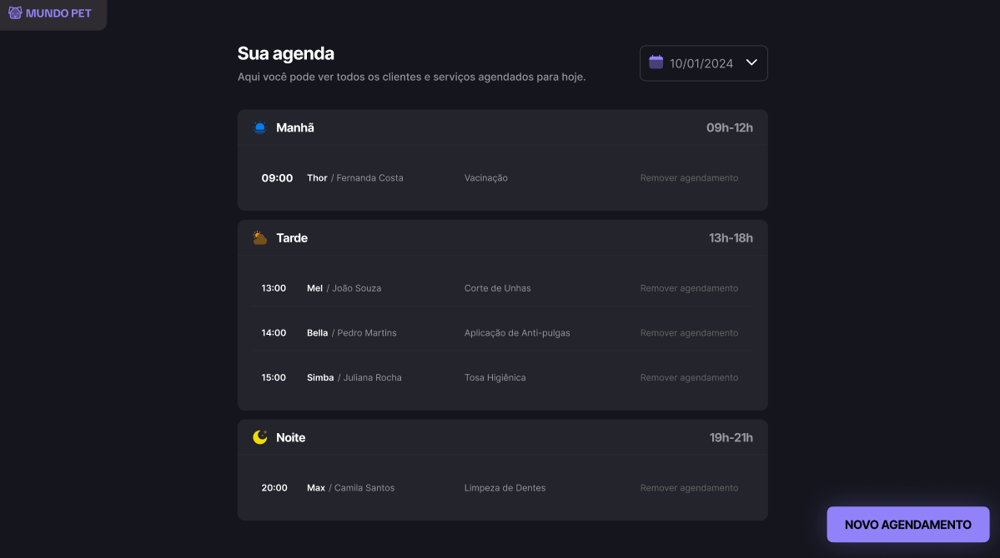

# Petshop Scheduler

Petshop Scheduler é um aplicativo web simples para agendamento de serviços em um petshop. O usuário pode escolher um período (manhã, tarde ou noite), selecionar o serviço desejado, inserir o nome do pet, nome do dono, telefone e outras informações relevantes.

Após o agendamento, um dashboard exibe todos os serviços marcados no dia atual, permitindo também visualizar agendamentos de outros dias.



## Tecnologias Utilizadas
- HTML
- CSS
- JavaScript
- Webpack
- Babel
- JSON Server (para simular uma API REST)

## Como Executar o Projeto Localmente
Siga os passos abaixo para rodar o Petshop Scheduler na sua máquina:

### 1. Clonar o Repositório
```sh
git clone https://github.com/seu-usuario/petshop-scheduler.git
cd petshop-scheduler
```

### 2. Instalar as Dependências
```sh
npm install
```

### 3. Rodar o JSON Server
O JSON Server simula uma API para armazenar os agendamentos. Execute:
```sh
npx json-server server.json --watch
```
Por padrão, ele rodará na porta `3000`. Se precisar mudar a porta, use `--port <numero>`.

### 4. Iniciar a Aplicação
```sh
npm run dev
```
O Webpack rodará a aplicação localmente.

### 5. Acessar no Navegador
Abra:
```
http://localhost:8080
```
para visualizar a aplicação. Se o Webpack indicar outra porta, use-a para acessar.

---
Agora você pode testar o Petshop Scheduler localmente e gerenciar os agendamentos! 🚀

